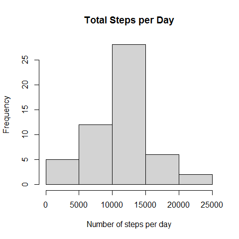
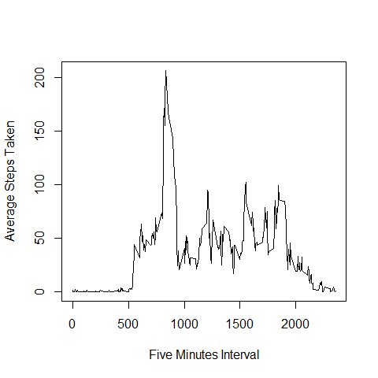
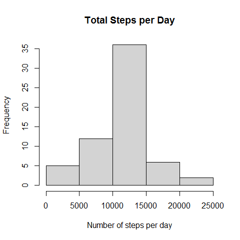
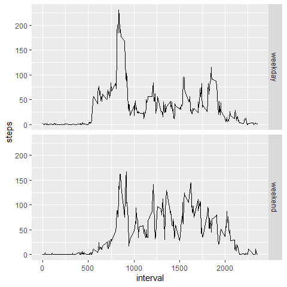

## Loading and preprocessing the data

```r
unzip("activity.zip")
activity <- read.csv("activity.csv")
```

## What is mean total number of steps taken per day?

```r
stepsDay <- aggregate(steps ~ date, data = activity, sum)
hist(stepsDay$steps, main = "Total Steps per Day", xlab = "Number of steps per day")
```


Mean and Median of total steps per day:

```r
mean(stepsDay$steps)
```

```
## [1] 10766.19
```

```r
median(stepsDay$steps)
```

```
## [1] 10765
```

## What is the average daily activity pattern?

```r
intervalSteps <- aggregate(steps ~ interval, data = activity, mean)
plot(intervalSteps$interval, intervalSteps$steps, type = "l", xlab = "Five Minutes Interval", ylab = "Average Steps Taken")
```


The maximum number of stepes taken on a 5 minutes interval happens on interval:

```r
lineMax <- which.max(intervalSteps$steps)
intervalSteps[lineMax, ]
```

```
##     interval    steps
## 104      835 206.1698
```
## Imputing missing values

cheking the number of missing values

```r
sum(is.na(activity$steps))
```

```
## [1] 2304
```

using the mean of that 5 minute interval to substitute NAs

```r
library(dplyr)
```

```
## 
## Attaching package: 'dplyr'
```

```
## The following objects are masked from 'package:stats':
## 
##     filter, lag
```

```
## The following objects are masked from 'package:base':
## 
##     intersect, setdiff, setequal, union
```

```r
names(intervalSteps) <- c("interval", "meanSteps")
combined = left_join(activity, intervalSteps)
```

```
## Joining, by = "interval"
```

```r
cleaned <- mutate(combined, steps = ifelse(is.na(steps), meanSteps, steps))
newStepsDay <- aggregate(steps ~ date, data = cleaned, sum)
hist(newStepsDay$steps, main = "Total Steps per Day", xlab = "Number of steps per day")
```


Mean and Median of total steps per day after substitute NAs:

```r
mean(newStepsDay$steps)
```

```
## [1] 10766.19
```

```r
median(newStepsDay$steps)
```

```
## [1] 10766.19
```
## Are there differences in activity patterns between weekdays and weekends?

```r
library(ggplot2)
cleaned$date <- as.Date(cleaned$date)
cleaned$weekday <- weekdays(cleaned$date)
####R is in portuguese######
cleaned <- mutate(cleaned, weekday = ifelse(weekday == "domingo"| weekday == "sábado", "weekend", "weekday"))
stepsWeekday <- aggregate(steps ~ interval + weekday, data = cleaned, mean)
qplot(interval, steps, data = stepsWeekday, facets = weekday~., geom = "line")
```




